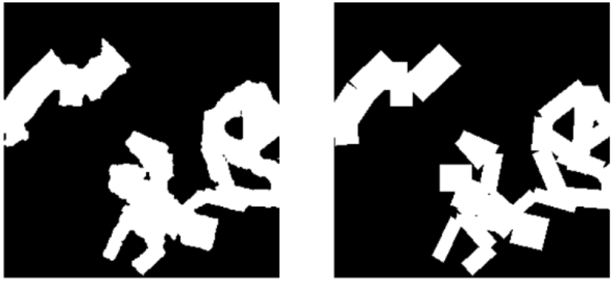

# Aaltoes-CV-Hackthon: Surf in Wild Rift



This repository contains a PyTorch-based pipeline for AI-image Detection tasks on a Kaggle competition dataset. It demonstrates how to train and evaluate popular segmentation models.
🏆 This project achieved a **97.2% score** and secured **2nd place** in the **Aaltoes 2025 Computer Vision v1** Kaggle competition.  
👥 Team: **Ziyi Wang**, **Rijie Hao**, **Zhuchenyang Liu**


## 📚 Table of Contents  
1. [✨ Features](#features)  
2. [💻 Requirements](#requirements)  
3. [🗂️ Dataset](#dataset)  
   - [Overview](#overview)  
   - [Files](#files)  
   - [Data Format](#data-format)  
4. [🚀 Usage](#usage)  
   - [Training](#training)  
   - [Inference](#inference)  
   - [Threshold Optimization](#threshold-optimization)  
5. [🤝 Model Ensemble](#model-ensemble)  
6. [📊 Results](#results)  
7. [⚙️ Arguments and Options](#arguments-and-options)  
8. [📁 Project Structure](#project-structure)  
9. [🔗 Related Resources](#related-resources)  
10. [📝 License](#license)  


---

## Features

- **Multiple models in one framework**: Easily switch between U-Net, ResUNet, AttentionUNet, SegFormer, and Mask2Former.  
- **Flexible device setup**: Runs on GPU if available; falls back to CPU automatically otherwise.  
- **Configurable hyperparameters**: Adjust learning rate, batch size, epochs, threshold, etc.  
- **Run-Length Encoding (RLE)**: Automatically encodes predicted masks in RLE format for Kaggle submissions.  
- **Validation**: Splits the training dataset into train/val sets for monitoring performance via Dice coefficient.  
- **Easy inference**: Generate submission files for Kaggle evaluation.  

---

## Requirements

- [PyTorch](https://pytorch.org/) (with GPU support if you want to train on CUDA)
- [torchvision](https://pytorch.org/vision/stable/)
- [OpenCV](https://opencv.org/)
- [scikit-learn](https://scikit-learn.org/)
- [pandas](https://pandas.pydata.org/)
- [tqdm](https://github.com/tqdm/tqdm)

You can install the required Python packages via:

```bash
pip install -r requirements.txt
```

---

## Dataset

You can download dataset via
```bash
kaggle competitions download -c aaltoes-2025-computer-vision-v-1
```
Please place your data in Datasets folder.

### Overview
This competition provides a dataset of **46836 images**, each with its original version and corresponding binary mask indicating inpainted regions. All images are **256×256 pixels** in size.

### Files

- **train/** - Directory containing training data:
  - **images/** - Manipulated versions of the images
  - **masks/** - Binary masks indicating inpainted regions
  - **originals/** - Original versions of the images
- **test/** - Directory containing test data:
  - **images/** - Manipulated versions of the images
- **sample_submission.csv** - Example submission file in the correct format

### Data Format

#### Images
- **Format:** PNG
- **Resolution:** 256×256 pixels
- **Color space:** RGB (3 channels)

#### Masks
- **Format:** PNG
- **Resolution:** 256×256 pixels
- **Values:**
  - **0:** Original (non-inpainted) regions
  - **1:** Inpainted (manipulated) regions

---

## Usage
### Training
To train a model, run the main script with appropriate arguments. You can also you the run.sh to train or inference.

```bash
python train.py \
    --model "Mask2Fomer" \
    --batch_size 16 \
    --epochs 30 \
    --lr 1e-4 \
    --num_workers 4 \
    --train_image_dir "../Dataset/train/train/images" \
    --train_mask_dir "../Dataset/train/train/masks" \
    --test_image_dir "../Dataset/test/test/images" \
    --threshold 0.5
```


### Inference
For inference you need add model name and the path to the pretrained model.

```bash
python train.py \
    --model "Mask2Former" \
    --test_image_dir "../Dataset/test/test/images" \
    --load_pretrain "/path/to/your/best_model.pth" \
    --threshold 0.5
```
---

### Threshold Optimization

#### Validation Set Inference  
First, generate the float mask predictions from your target model on the validation set:  

```bash
python train.py \
    --model "Mask2Former" \
    --predict_validation True \
    --load_pretrain "/path/to/your/best_model.pth" 
```

#### Optimization

Next, you can optimize the threshold using `Mask2Former/threshold_optimization.ipynb`.
To adjust the search gap, modify the following line:

```python
thresholds = np.linspace(0.4, 0.7, 20) 
```

Example output:

```bash
Optimal threshold: 0.637 with Dice coefficient: 0.9667

Threshold results:
    Threshold  Mean_Dice
0    0.400000   0.392585
1    0.415789   0.392585
2    0.431579   0.392585
3    0.447368   0.392585
...
```


---

## Models Ensemble 

To further improve the prediction score, try the ensemble method.

After gathering multiple encoded `submission.csv` by different models, you can try the ensemble strategy using `Mask2Former/ensemble.ipynb`.

Adjust the combination of models and the voting threshold by modifying: `VOTE_THRESHOLD`.

---

## 🏆 Our Result

The final private leaderboard result is based on the ensemble of three fine-tuned models with threshold optimization:

| Model                                      | Threshold | Public Dice Coefficient | Private Dice Coefficient |
|--------------------------------------------|----------|-------------------------|--------------------------|
| **mask2former-swin-small-ade-semantic**    | 0.61     | 0.9678                  | 0.9651                   |
| **mask2former-swin-base-ade-semantic**     | 0.62     | 0.9686                  | 0.9677                   |
| **mask2former-swin-large-ade-semantic**    | 0.61     | 0.9659                  | 0.9639                   |
| **Ensemble**                               | /        | **0.9733**              | **0.9713**               |

Here are some prediction samples:


🎉 We achieved **second place** in the **Aaltoes-CV-Hackathon** competition!  


## License

Shield: [](https://opensource.org/licenses/MIT)

This project is licensed under a [MIT License](LICENSE).

---

## Related resources
We acknowledge all the open-source contributors for the following projects to make this work possible:

- [Mask2Former](https://github.com/facebookresearch/Mask2Former)
- [SegFormer](https://github.com/facebookresearch/Mask2Former)

- [IML-ViT](https://github.com/SunnyHaze/IML-ViT)
- [Huggingface 🤗](https://huggingface.co/)